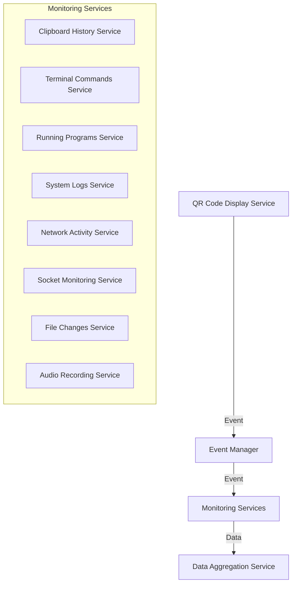

# Personal Computer Monitoring System

- **`Contents of this repository's files were generated by` [Soft-Architect|Hard-Coder](https://chatgpt.com/g/g-tPrIpayio-soft-architect-hard-coder)**
  - Instructions and configuration for the authoring assistant: [https://github.com/sparesparrow/hard-coder](https://github.com/sparesparrow/hard-coder)
  - **TODO** *(human)*: `Review, test, iterate. Identify flaws in current implementation and fix them.`

## Overview

This project is designed to monitor various aspects of a user's activity on a personal computer, display QR codes with context information, and assist the user by providing relevant suggestions and help based on the collected data. The architecture is based on a combination of Microservices Architecture and Event-Driven Architecture, enabling scalability and easy maintenance.

### Components

- **QR Code Display Service**: Displays QR codes in a dedicated window.
- **Screenshot Service**: Periodically takes screenshots of the user's screen.
- **Event Manager**: Manages events and communication between services.
- **Clipboard History Service**: Monitors the clipboard history.
- **Terminal Commands Service**: Monitors terminal commands.
- **Running Programs Service**: Monitors running programs and processes.
- **System Logs Service**: Monitors system logs.
- **Network Activity Service**: Monitors network activity.
- **Socket Monitoring Service**: Monitors active sockets.
- **File Changes Service**: Monitors file changes in user directories.
- **Audio Recording Service**: Records audio and transcribes it to text.
- **Data Aggregation Service**: Aggregates collected data and creates prompts for the assistant.

### Architecture



### Component Structure

```mermaid
graph TD
    A[QR Code Display Service]
    A --> B[QRCodeDisplayService]
    B --> B1[display_qr_code]
    B --> B2[remove_qr_code]
    B --> B3[update_qr_code]

    C[Event Manager]
    C --> D[EventManager]
    D --> D1[publish_event]
    D --> D2[subscribe_to_event]
    D --> D3[run]
    D --> D4[add_event]

    E[Screenshot Service]
    E --> F[ScreenshotService]
    F --> F1[take_screenshot]
    F --> F2[start_periodic_screenshots]

    G[Clipboard History Service]
    G --> H[ClipboardHistoryService]
    H --> H1[monitor_clipboard]

    I[Terminal Commands Service]
    I --> J[TerminalCommandsService]
    J --> J1[monitor_terminal_commands]

    K[Running Programs Service]
    K --> L[RunningProgramsService]
    L --> L1[monitor_running_programs]

    M[System Logs Service]
    M --> N[SystemLogsService]
    N --> N1[monitor_system_logs]

    O[Network Activity Service]
    O --> P[NetworkActivityService]
    P --> P1[monitor_network_activity]

    Q[Socket Monitoring Service]
    Q --> R[SocketMonitoringService]
    R --> R1[monitor_sockets]

    S[File Changes Service]
    S --> T[FileChangesService]
    T --> T1[snapshot_directory]
    T --> T2[monitor_file_changes]

    U[Audio Recording Service]
    U --> V[AudioRecordingService]
    V --> V1[record_audio]
    V --> V2[transcribe_audio]
    V --> V3[start_periodic_recording]

    W[Data Aggregation Service]
    W --> X[DataAggregationService]
    X --> X1[aggregate_data]
    X --> X2[create_assistant_prompt]
```



### Class Diagram

```mermaid
classDiagram
    QRCodeDisplayService --|> EventManager
    ScreenshotService --|> EventManager
    ClipboardHistoryService --|> EventManager
    TerminalCommandsService --|> EventManager
    RunningProgramsService --|> EventManager
    SystemLogsService --|> EventManager
    NetworkActivityService --|> EventManager
    SocketMonitoringService --|> EventManager
    FileChangesService --|> EventManager
    AudioRecordingService --|> EventManager
    DataAggregationService --|> EventManager

    class QRCodeDisplayService {
        - display_qr_code()
        - remove_qr_code()
        - update_qr_code()
    }

    class EventManager {
        - publish_event()
        - subscribe_to_event()
        - run()
        - add_event()
    }

    class ScreenshotService {
        - take_screenshot()
        - start_periodic_screenshots()
    }

    class ClipboardHistoryService {
        - monitor_clipboard()
    }

    class TerminalCommandsService {
        - monitor_terminal_commands()
    }

    class RunningProgramsService {
        - monitor_running_programs()
    }

    class SystemLogsService {
        - monitor_system_logs()
    }

    class NetworkActivityService {
        - monitor_network_activity()
    }

    class SocketMonitoringService {
        - monitor_sockets()
    }

    class FileChangesService {
        - snapshot_directory()
        - monitor_file_changes()
    }

    class AudioRecordingService {
        - record_audio()
        - transcribe_audio()
        - start_periodic_recording()
    }

    class DataAggregationService {
        - aggregate_data()
        - create_assistant_prompt()
    }
```



### Installation

To install the project, clone the repository and install the required dependencies.

```bash
git clone <repository_url>
cd project_root
pip install -r requirements.txt
```

### Usage

Start the services in the following order:

1. Event Manager
2. QR Code Display Service
3. All monitoring services
4. Data Aggregation Service
5. Screenshot Service

```bash
python event_manager/EventManager.py
python qr_code_display_service/QRCodeDisplayService.py
python clipboard_history_service/ClipboardHistoryService.py
python terminal_commands_service/TerminalCommandsService.py
python running_programs_service/RunningProgramsService.py
python system_logs_service/SystemLogsService.py
python network_activity_service/NetworkActivityService.py
python socket_monitoring_service/SocketMonitoringService.py
python file_changes_service/FileChangesService.py
python audio_recording_service/AudioRecordingService.py
python data_aggregation_service/DataAggregationService.py
python screenshot_service/ScreenshotService.py
```

### Contributing

Please read `CONTRIBUTING.md` for details on our code of conduct and the process for submitting pull requests to us.

### License

This project is licensed under the MIT License - see the `LICENSE.md` file for details.
